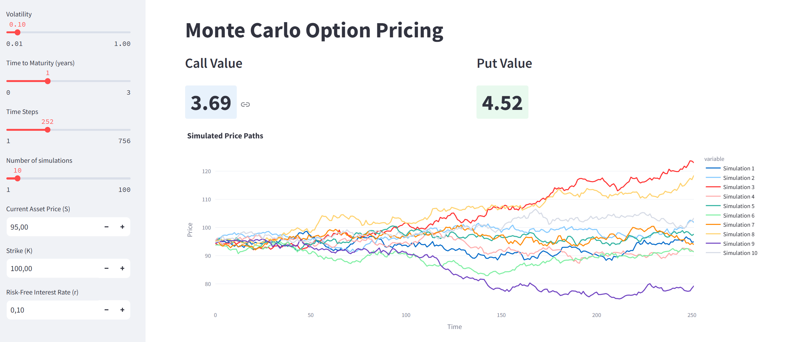

# Monte Carlo Option Pricing App
The purpose of this web application is to price call and put options through Monte Carlo methods. The simulations of the underlying asset price path are displayed so the user can have a visualization of the model estimations. 

[Monte Carlo Option Pricing Web App](https://montecarlopricing.streamlit.app/)

## Features
- Monte Carlo option pricing
- Monte Carlo simulations chart

## Technologies Used
- **Python**: Implement the logic for the pricing model, heatmap and greeks.
- **Streamlit**: User interface

## Demo


## Relevant Code

### Monte Carlo simulations function
```python
def montecarlo_simulations(s, k, vol, rf, t, num_drifts, num_simulations):

    dt = t/num_drifts
    prices = []
    final_list = []

    for i in range(num_simulations):
        price_list = []
        s_copy = s
        for n in range(num_drifts):
            s_copy*= math.exp((rf - 0.5 * vol**2) * dt + vol * math.sqrt(dt) * np.random.normal(0, 1))
            price_list.append(s_copy)
        prices.append(price_list)
        final_list.append(price_list[-1])

    global final_prices
    final_prices = final_list

    fig = go.Figure()
    df = pd.DataFrame(prices).T
    df.columns = [f"Simulation {i+1}" for i in range(num_simulations)]

    fig = px.line(df)
        
    fig.update_layout(title=f'Simulated Price Paths',
                      xaxis_title='Time',
                      yaxis_title='Price') 
    return fig

```

### Monte Carlo pricing function
```python
def montecarlo_pricing(option_type, s, k, vol, rf, t):
    if option_type == "Call":
        call_value = 0
        count = 0
        for i in range(len(final_prices)):
            intrinsic_value = max(final_prices[i] - k, 0)  
            present_value = intrinsic_value * math.exp(-rf * t)
            call_value += present_value
            count += 1
        return call_value / count  
    elif option_type == "Put":
        put_value = 0
        count = 0
        for i in range(len(final_prices)):
            intrinsic_value = max(k - final_prices[i], 0)
            present_value = intrinsic_value * math.exp(-rf * t)
            put_value += present_value
            count += 1
        return put_value / count 
```